# CryptoIdentityManager

Il `CryptoIdentityManager` è una classe che gestisce automaticamente la generazione e il salvataggio delle identità crypto dopo l'autenticazione SEA dell'utente in ShogunCore.

## 🚀 Caratteristiche

- **Generazione automatica**: Le identità crypto vengono generate automaticamente dopo login/signup
- **Crittografia SEA**: Tutte le identità vengono criptate usando il SEA pair dell'utente
- **Salvataggio su GunDB**: Le identità criptate vengono salvate nel database decentralizzato
- **Recupero sicuro**: Possibilità di recuperare e decriptare le identità salvate
- **Supporto multi-metodo**: Funziona con tutti i metodi di autenticazione (password, WebAuthn, ZK-Proof, etc.)

## 🔐 Identità Crypto Generate

Il sistema genera automaticamente le seguenti identità crypto:

1. **RSA-4096 Key Pair**: Per crittografia asimmetrica
2. **AES-256 Symmetric Key**: Per crittografia simmetrica
3. **Signal Protocol Identity**: Per messaggi end-to-end sicuri
4. **PGP Key Pair**: Per compatibilità OpenPGP
5. **MLS Group**: Per comunicazioni di gruppo sicure
6. **SFrame Key**: Per crittografia media

## 📦 Installazione

Il `CryptoIdentityManager` è incluso in `shogun-core`:

```bash
npm install shogun-core
```

## 🔧 Utilizzo

### Utilizzo Automatico

Le identità crypto vengono generate automaticamente durante il processo di autenticazione:

```typescript
import { ShogunCore } from 'shogun-core';

const core = new ShogunCore();
await core.initialize({
  gunOptions: {
    peers: ["https://gunjs.herokuapp.com/gun"]
  }
});

// Registra un nuovo utente - le identità crypto vengono generate automaticamente
const signupResult = await core.signUp("mario_rossi", "password123");

if (signupResult.success) {
  console.log("✅ Utente registrato con identità crypto generate automaticamente");
}
```

### Utilizzo Manuale

Puoi anche gestire manualmente le identità crypto:

```typescript
import { ShogunCore, CryptoIdentityManager } from 'shogun-core';

const core = new ShogunCore();
await core.initialize();

// Crea un'istanza del manager
const cryptoManager = new CryptoIdentityManager(core);

// Genera identità per un utente specifico
const identities = await cryptoManager.generateAllIdentities(
  "mario_rossi", 
  seaPair
);

// Salva le identità su GunDB
const saveResult = await cryptoManager.saveIdentitiesToGun(
  "mario_rossi",
  identities.identities!,
  seaPair
);

// Recupera le identità salvate
const retrieveResult = await cryptoManager.retrieveIdentitiesFromGun(
  "mario_rossi",
  seaPair
);
```

### Recupero delle Identità Correnti

```typescript
// Ottieni le identità dell'utente attualmente autenticato
const currentIdentities = await cryptoManager.getCurrentUserIdentities();

if (currentIdentities.success) {
  const identities = currentIdentities.identities!;
  
  console.log("Identità disponibili:");
  console.log("- RSA:", !!identities.rsa);
  console.log("- AES:", !!identities.aes);
  console.log("- Signal:", !!identities.signal);
  console.log("- PGP:", !!identities.pgp);
  console.log("- MLS:", !!identities.mls);
  console.log("- SFrame:", !!identities.sframe);
}
```

## 🔄 Flusso di Funzionamento

```mermaid
graph TD
    A[Utente fa Login/Signup] --> B[ShogunCore genera SEA Pair]
    B --> C[runPostAuthOnAuthResult]
    C --> D[CryptoIdentityManager.setupCryptoIdentities]
    D --> E[Genera RSA-4096 Key Pair]
    D --> F[Genera AES-256 Symmetric Key]
    D --> G[Genera Signal Protocol Identity]
    D --> H[Genera PGP Key Pair]
    D --> I[Inizializza MLS Group]
    D --> J[Genera SFrame Key]
    E --> K[Serializza tutte le identità]
    F --> K
    G --> K
    H --> K
    I --> K
    J --> K
    K --> L[Cripta con SEA.encrypt usando SEA Pair]
    L --> M[Salva su GunDB nel percorso privato utente]
    M --> N[Salva hash per verifica integrità]
    N --> O[Identità crypto pronte per l'uso]
    
    style A fill:#e1f5fe
    style B fill:#f3e5f5
    style O fill:#e8f5e8
    style L fill:#fff3e0
    style M fill:#fce4ec
```



## 🛡️ Sicurezza

- **Crittografia End-to-End**: Tutte le identità sono criptate con il SEA pair dell'utente
- **Accesso Privato**: Solo l'utente proprietario può decriptare le proprie identità
- **Salvataggio Sicuro**: Le identità sono salvate nel percorso privato dell'utente su GunDB
- **Verifica Integrità**: Viene salvato un hash per verificare l'integrità dei dati

## 🔧 API Reference

### CryptoIdentityManager

#### `generateAllIdentities(username: string, seaPair: ISEAPair): Promise<IdentityGenerationResult>`
Genera tutte le identità crypto disponibili per un utente.

#### `saveIdentitiesToGun(username: string, identities: CryptoIdentities, seaPair: ISEAPair): Promise<IdentitySaveResult>`
Cripta e salva le identità crypto su GunDB.

#### `retrieveIdentitiesFromGun(username: string, seaPair: ISEAPair): Promise<IdentityRetrievalResult>`
Recupera e decripta le identità crypto da GunDB.

#### `setupCryptoIdentities(username: string, seaPair: ISEAPair, forceRegenerate?: boolean): Promise<IdentityGenerationResult & IdentitySaveResult>`
Processo completo: genera, salva e gestisce le identità crypto.

#### `getCurrentUserIdentities(): Promise<IdentityRetrievalResult>`
Ottiene le identità crypto dell'utente corrente.

#### `hasStoredIdentities(username: string): Promise<boolean>`
Verifica se l'utente ha già delle identità crypto salvate.

## 📝 Esempi

Vedi il file `src/examples/crypto-identity-example.ts` per esempi completi di utilizzo.

## 🔗 Integrazione

Il `CryptoIdentityManager` si integra automaticamente con:
- **ShogunCore**: Per l'accesso a GunDB e SEA
- **Sistema di Autenticazione**: Per la generazione automatica dopo login/signup
- **Modulo Crypto**: Per l'utilizzo delle funzioni crittografiche
- **Tutti i Plugin di Autenticazione**: WebAuthn, ZK-Proof, Nostr, Web3, etc.

## 🐛 Troubleshooting

### Le identità non vengono generate automaticamente
- Verifica che l'utente sia autenticato correttamente
- Controlla che il SEA pair sia disponibile
- Verifica i log per errori durante la generazione

### Errore durante il salvataggio
- Verifica la connessione a GunDB
- Controlla che l'utente abbia i permessi di scrittura
- Verifica che il SEA pair sia valido

### Errore durante il recupero
- Verifica che le identità siano state salvate correttamente
- Controlla che il SEA pair sia lo stesso usato per il salvataggio
- Verifica che l'utente sia autenticato
