# CryptoIdentityManager

Il `CryptoIdentityManager` è un wrapper che gestisce la generazione delle identità crypto. Il salvataggio su GunDB è gestito lato frontend.

## 🚀 Caratteristiche

- **Generazione identità**: Genera tutte le identità crypto disponibili (RSA, AES, Signal, PGP, MLS, SFrame)
- **Wrapper semplice**: Interfaccia semplice per generare identità senza salvataggio automatico
- **Supporto multi-metodo**: Funziona con tutti i metodi di autenticazione (password, WebAuthn, ZK-Proof, etc.)

## 🔐 Identità Crypto Generate

Il sistema genera automaticamente le seguenti identità crypto:

1. **RSA-4096 Key Pair**: Per crittografia asimmetrica
2. **AES-256 Symmetric Key**: Per crittografia simmetrica
3. **Signal Protocol Identity**: Per messaggi end-to-end sicuri
4. **PGP Key Pair**: Per compatibilità OpenPGP
5. **MLS Group**: Per comunicazioni di gruppo sicure
6. **SFrame Key**: Per crittografia media

## 📦 Installazione

Il `CryptoIdentityManager` è incluso in `shogun-core`:

```bash
npm install shogun-core
```

## 🔧 Utilizzo

### Utilizzo Base

Genera le identità crypto dopo l'autenticazione:

```typescript
import { ShogunCore, CryptoIdentityManager } from 'shogun-core';
import type { ISEAPair } from 'gun/types';

const core = new ShogunCore();
await core.initialize({
  gunOptions: {
    peers: ["https://gunjs.herokuapp.com/gun"]
  }
});

// Registra un nuovo utente
const signupResult = await core.signUp("mario_rossi", "password123");

if (signupResult.success && signupResult.sea) {
  // Crea un'istanza del manager
  const cryptoManager = new CryptoIdentityManager();

  // Genera identità per l'utente
  const result = await cryptoManager.generateAllIdentities(
    signupResult.username,
    signupResult.sea
  );

  if (result.success && result.identities) {
    console.log("✅ Identità crypto generate");
    console.log("- RSA:", !!result.identities.rsa);
    console.log("- AES:", !!result.identities.aes);
    console.log("- Signal:", !!result.identities.signal);
    console.log("- PGP:", !!result.identities.pgp);
    console.log("- MLS:", !!result.identities.mls);
    console.log("- SFrame:", !!result.identities.sframe);
    
    // Salva le identità su GunDB lato frontend se necessario
    // Esempio:
    // const encrypted = await SEA.encrypt(JSON.stringify(result.identities), seaPair.priv);
    // core.db.gun.user().get("crypto-identities").put(encrypted);
  }
}
```

### Utilizzo con setupCryptoIdentities

Il metodo `setupCryptoIdentities` è un wrapper che chiama `generateAllIdentities`:

```typescript
const cryptoManager = new CryptoIdentityManager();

const result = await cryptoManager.setupCryptoIdentities(
  "username",
  seaPair,
  false // forceRegenerate - ignorato, sempre genera nuove identità
);

if (result.success && result.identities) {
  // Usa le identità generate
  // Salvataggio gestito lato frontend
}
```

## 🔄 Flusso di Funzionamento

```mermaid
graph TD
    A[Utente fa Login/Signup] --> B[ShogunCore genera SEA Pair]
    B --> C[Frontend chiama CryptoIdentityManager]
    C --> D[generateAllIdentities]
    D --> E[Genera RSA-4096 Key Pair]
    D --> F[Genera AES-256 Symmetric Key]
    D --> G[Genera Signal Protocol Identity]
    D --> H[Genera PGP Key Pair]
    D --> I[Inizializza MLS Group]
    D --> J[Genera SFrame Key]
    E --> K[Restituisce tutte le identità]
    F --> K
    G --> K
    H --> K
    I --> K
    J --> K
    K --> L[Frontend gestisce il salvataggio]
    L --> M[Cripta con SEA se necessario]
    M --> N[Salva su GunDB dal frontend]
    N --> O[Identità crypto pronte per l'uso]
    
    style A fill:#e1f5fe
    style B fill:#f3e5f5
    style O fill:#e8f5e8
    style L fill:#fff3e0
    style N fill:#fce4ec
```



## 🛡️ Sicurezza

- **Generazione sicura**: Le identità vengono generate usando algoritmi crittografici standard
- **Gestione lato frontend**: Il salvataggio e la crittografia sono gestiti dal frontend
- **Controllo completo**: Il frontend ha controllo completo sul processo di salvataggio

## 🔧 API Reference

### CryptoIdentityManager

#### Costruttore
```typescript
constructor()
```
Crea una nuova istanza di CryptoIdentityManager. Non richiede parametri.

#### `generateAllIdentities(username: string, seaPair: ISEAPair): Promise<IdentityGenerationResult>`
Genera tutte le identità crypto disponibili per un utente.

**Parametri:**
- `username`: Nome utente
- `seaPair`: Coppia di chiavi SEA dell'utente (opzionale, non più utilizzato ma mantenuto per compatibilità)

**Restituisce:**
- `IdentityGenerationResult` con le identità generate

#### `setupCryptoIdentities(username: string, seaPair: ISEAPair, forceRegenerate?: boolean): Promise<IdentityGenerationResult>`
Wrapper che chiama `generateAllIdentities`. Mantenuto per compatibilità.

**Parametri:**
- `username`: Nome utente
- `seaPair`: Coppia di chiavi SEA dell'utente (opzionale)
- `forceRegenerate`: Ignorato, genera sempre nuove identità

## 📝 Esempi

Vedi il file `src/examples/crypto-identity-example.ts` per esempi completi di utilizzo.

## 🔗 Integrazione

Il `CryptoIdentityManager` si integra automaticamente con:
- **ShogunCore**: Per l'accesso a GunDB e SEA
- **Sistema di Autenticazione**: Per la generazione automatica dopo login/signup
- **Modulo Crypto**: Per l'utilizzo delle funzioni crittografiche
- **Tutti i Plugin di Autenticazione**: WebAuthn, ZK-Proof, Nostr, Web3, etc.

## 🐛 Troubleshooting

### Le identità non vengono generate
- Verifica che tutti i parametri siano corretti
- Controlla i log per errori durante la generazione
- Assicurati che i moduli crypto (PGP, MLS, SFrame) siano inizializzati correttamente

### Errore durante la generazione di una specifica identità
- Alcune identità potrebbero fallire (MLS, PGP) - questo è normale
- Le identità generate con successo saranno comunque restituite
- Verifica i log per dettagli su quali identità sono fallite
